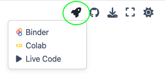

# Libro electrónico y python
"La imaginación es más importante que el conocimiento. El conocimiento es limitado, mientras que la imaginación abarca el mundo entero." - Albert Einstein

Esta sección introduce el uso de libros electrónicos, una herramienta clave para el estudio moderno. A lo largo de este recurso, encontrarás diversos tipos de mensajes como notas, tips, advertencias y explicaciones matemáticas. Cada uno está diseñado para mejorar tu comprensión y retención del material presentado, ofreciendo una experiencia de aprendizaje directa y centrada en el contenido. Este formato digital te permitirá interactuar con el material de manera efectiva, asegurando que cada concepto no solo sea comprendido sino también aplicable

## Cuadros de mensajes 
A lo largo del libro se estarán usando un par de msj que debes tomar en cuenta:

```{note}
**Nota Importante:** Esto es una nota o aclaración.
```

```{warning} Advertencia
 "Ten cuidado cuando..."
```

```{admonition} Antes de empezar 
:class: before
 "Deberás de tener claras algunas cosas antes"
```

```{admonition} Tip para esta actividad
:class: tip
 "Esto es un tip"
```

```{admonition} Desarrollo matemático
:class: dropdown

Aquí aparecerán un par de resultados matemáticos que te pueden ser útiles.

$$
y = \sin(x)
$$

$$
y = \cos(x)
$$

$$
y = \tan(x) = \frac{\sin(x)}{\cos(x)}
$$
```


```{admonition} Atención
:class: attention
 "...."
```

## Ejecutar el código de python 
Este libro permite interactuar con el contenido. Seleccione la opción que le resulte más conveniente

```{tip}
:class: dropdown

Las páginas que poseen el símbolo de un cohete son notebooks interactivas y se pueden ejecutar directamente haciendo clic en alguna de las opciones que vienen: 

1- Binder
2- Google Colab
3- Live Code


```

# Introducción a Python

Python es un lenguaje de programación poderoso y fácil de aprender. Aquí veremos dos conceptos básicos: comentarios y la función `print()`.

## Comentarios

Los comentarios se utilizan para explicar el código. No se ejecutan. Se crean con el símbolo `#`, cuando este símbolo no es usado al inicio se interpreta como una línea de código a ejecutar y dependiendo del comando que se use es la acción que se realizará, por ejemplo, para imprimir en pantalla se puede emplear el comando `print()` y dentro escribirmos entre comillas el msj.

```python
# Esto es un comentario
print("Hola, mundo")
```
## Operaciones Aritméticas
Algunas de las operaciones básicas que puedes realizar en Python son:
```python
# Suma
print(5 + 3)

# Resta
print(10 - 2)

# Multiplicación
print(4 * 2)

# División
print(8 / 2)

# Módulo (resto de la división)
print(10 % 3)

# Potencia
print(2 ** 3)

# División entera
print(9 // 2)
```

## Librerias 
Python ofrece una amplia gama de librerías estándar y de terceros, se importan con la palabra reservada `import`. Entre ellas, la librería `math` proporciona acceso a funciones matemáticas.

### Uso de la librería `math`

Para utilizar la librería `math`, primero es necesario importarla al inicio del código:

```python
import math
```

Después de la importación, puedes acceder a sus constantes y funciones. Por ejemplo, math.pi es una constante que representa el valor de π, y math.sin() es una función que calcula el seno de un número (el argumento dentro de los paréntesis).

```python
# Ejemplo utilizando math.pi y math.sin()
print("El seno de π es:", math.sin(math.pi))

# Ejemplo calculando la raíz cuadrada de 4 con math.sqrt()
print("La raíz cuadrada de 4 es:", math.sqrt(4))
```
### Uso de la libreria `numpy`

NumPy es una librería esencial en Python para el cálculo numérico, especialmente conocida por su eficiencia en operaciones con arrays y matrices. 

Para utilizar numpy, primero debes importarla al inicio de tu código:

```python
import numpy as np
```
Una vez importada, puedes aprovechar sus funciones y constantes. Por ejemplo, np.array para crear arreglos y np.sin para calcular el seno de los elementos de un arreglo.

```python
# Crear un arreglo de numpy
arreglo = np.array([np.pi, np.pi/2, np.pi/4])

# Calcular el seno del arreglo
seno_arreglo = np.sin(arreglo)
print("El seno del arreglo es:", seno_arreglo)

# Calcular la raíz cuadrada de cada elemento en un nuevo arreglo
raiz_arreglo = np.sqrt([1, 4, 9])
print("La raíz cuadrada del arreglo es:", raiz_arreglo)
```
```{note}
**Nota Importante:** Si bien es cierto que numpy es muy poderoso para la manipulación de grandes cantidades de datos nosotros lo emplearemos principalmente con el fin de realizar gráficas de funciones y para ello es necesario importar el modulo `matplotlib.pyplot`.
```
### Uso de la libreria `matplotlib.pyplot`

Al igual que en los otros modulos, matplotlib.pyplot se debe importar al inicio del código, pero también incluyendo a numpy:

```python
import numpy as np
import matplotlib.pyplot as plt
```
Luego, se pueden crear datos para graficar y se utilizan las funciones de matplotlib para crear una gráfica (plot, title, xlabel, ylabel, show, etc). 

Por ejemplo, para graficar una función seno:

```python
x = np.linspace(0, 2 * np.pi, 100)
y = np.sin(x)

plt.plot(x, y)
plt.title("Función Seno")
plt.xlabel("x")
plt.ylabel("sin(x)")
plt.show()
```

Con numpy se crean 100 puntos entre 0 y 2π que serán evaluados en la función y=sin(x).
Con plot indicamos las variables a graficar, title y label asignamos etiquetas al gráfico y con show se muestra el gráfico.  


## Citations

You can also cite references that are stored in a `bibtex` file. For example,
the following syntax: `` {cite}`holdgraf_evidence_2014` `` will render like
this: {cite}`holdgraf_evidence_2014`.

Moreover, you can insert a bibliography into your page with this syntax:
The `{bibliography}` directive must be used for all the `{cite}` roles to
render properly.
For example, if the references for your book are stored in `references.bib`,
then the bibliography is inserted with:

```{bibliography}
```